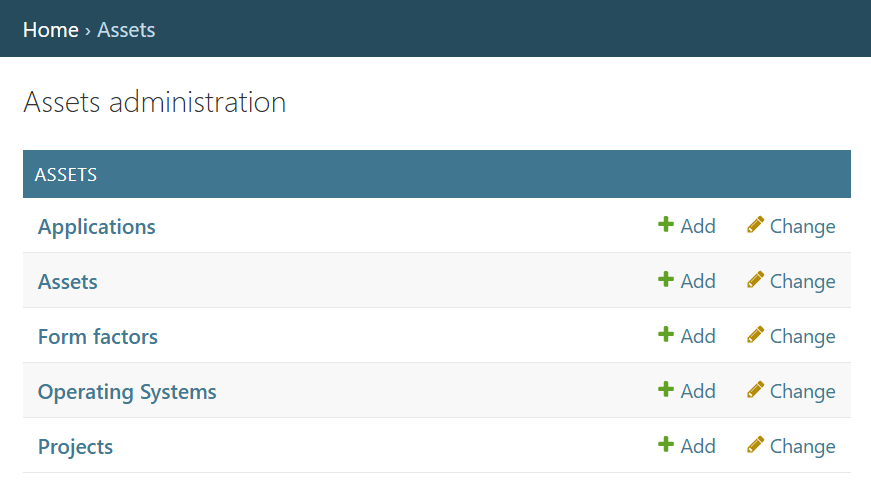
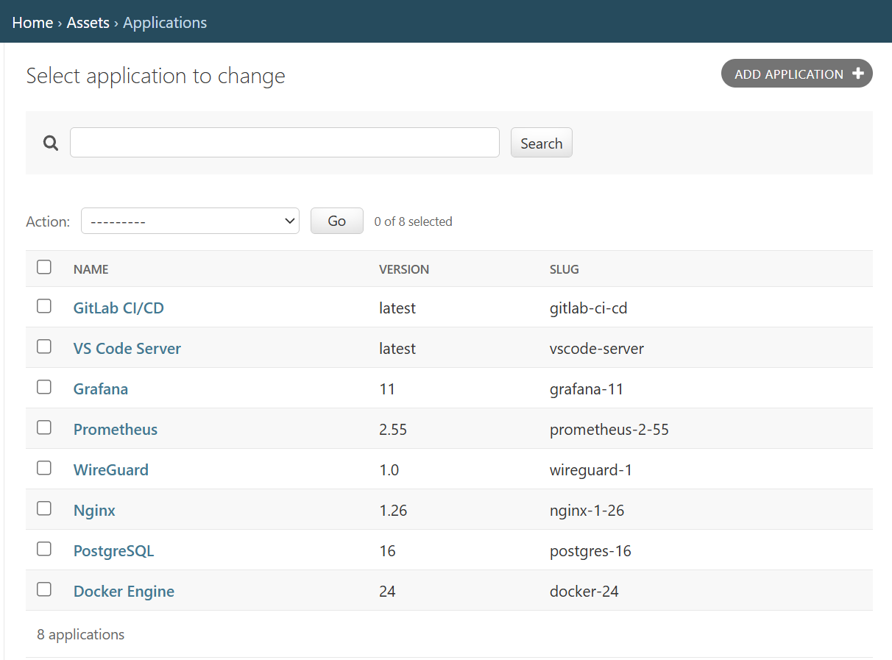
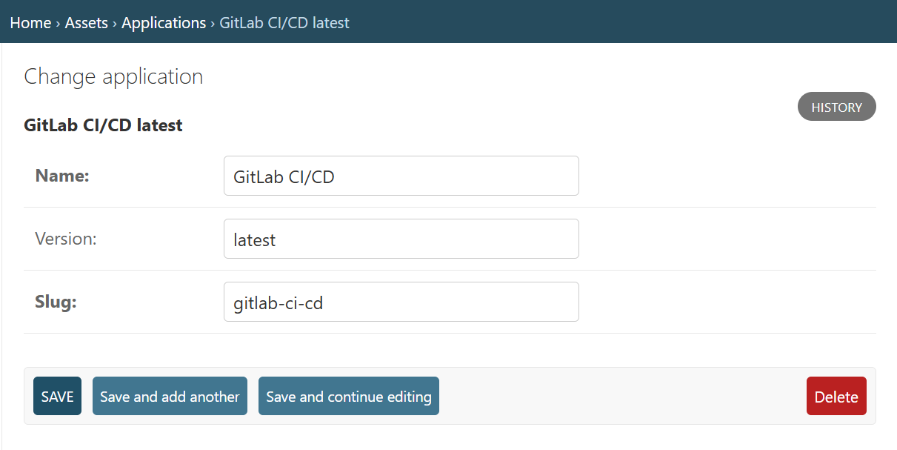
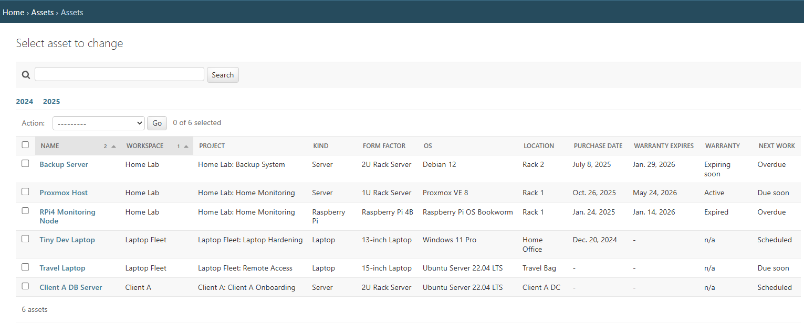
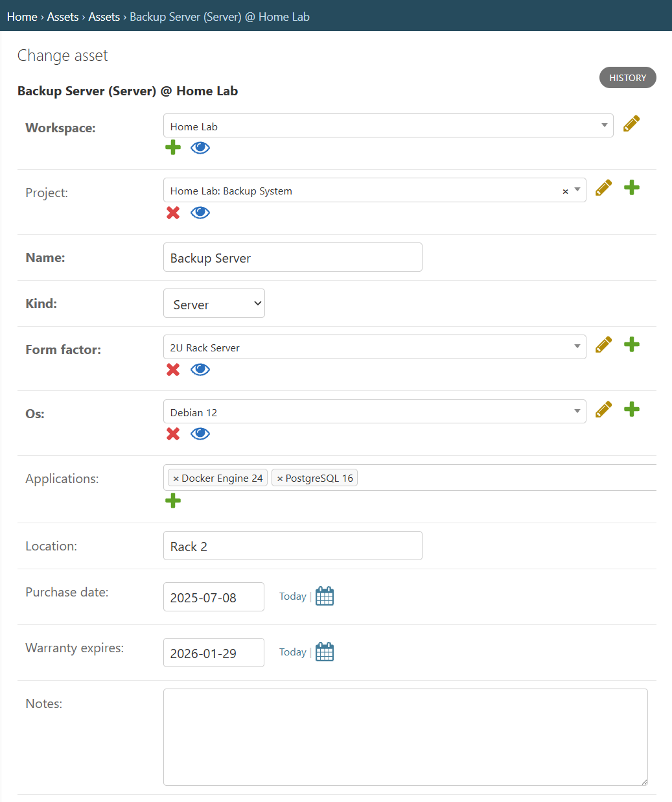
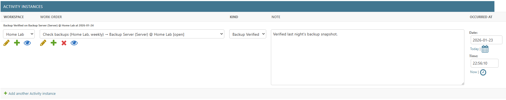
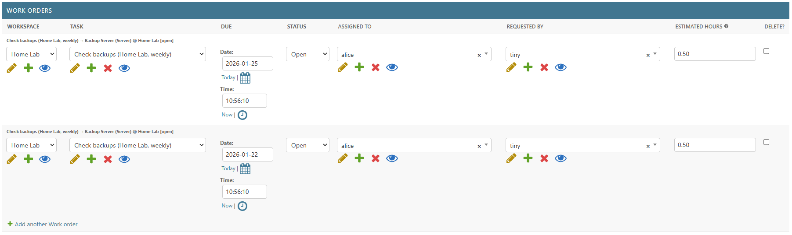

# Admin Audit (planit-mini) — `assets` app (screenshots-based)

This document is a **screenshots-based snapshot** of the Django Admin UI for the `assets` app in the `planit-mini` project.

**Important scope note:** this is **not a complete inventory** of all admin functionality in the repo.  
It only documents what is **directly evidenced** by the screenshots currently captured in `docs/IMAGES/`.

> Goal: a quick, truthful reference for what’s *confirmed* to be wired up in admin right now (based on screenshots),
> plus a place to append future screenshots / findings as the admin grows.

---

## Evidence scope

- **Evidence type:** screenshots only
- **Evidence folder:** `docs/IMAGES/`
- **Capture date (from filenames):** 2026-01-24
- **Known limitation:** there may be additional admin registrations, fields, list filters, search fields, actions, or other apps/models
  that are not represented here yet because they have not been captured in screenshots.

---

## App: `assets`

### Models visible in Admin (confirmed by screenshots)
- `Application`
- `Asset`

### Admin inlines (confirmed by screenshots)

#### `Application` admin
- **Inlines:** none shown in the current screenshots.

#### `Asset` admin
- **Inlines:** **yes**
  - `ActivityInstance` (inline on `Asset` change form)
  - `WorkOrder` (inline on `Asset` change form)

---

## Screenshots (evidence)

All images live in: `docs/IMAGES/`

### Admin index / app landing

### `Application` admin

#### List

#### Update

### `Asset` admin

#### List

#### Update

### `Asset` admin inlines

#### Inline: `ActivityInstance`

#### Inline: `WorkOrder`

---

## Next updates to capture (optional checklist)

- [ ] `Application` change form: confirm if any inlines exist (and capture if so)
- [ ] `Application` list view: capture list_display/search/filter if relevant
- [ ] `Asset` list view: capture list_display/search/filter if relevant
- [ ] `Asset` change form: capture all inlines expanded (if collapsible)
- [ ] Admin sidebar / index: confirm whether additional `assets` models exist beyond `Application` + `Asset`
