# Django Admin Screenshots Gallery

This document provides a visual index of all Django Admin interface screenshots for the planit-mini application.

## Dashboard & Navigation

### 00. Main Admin Dashboard
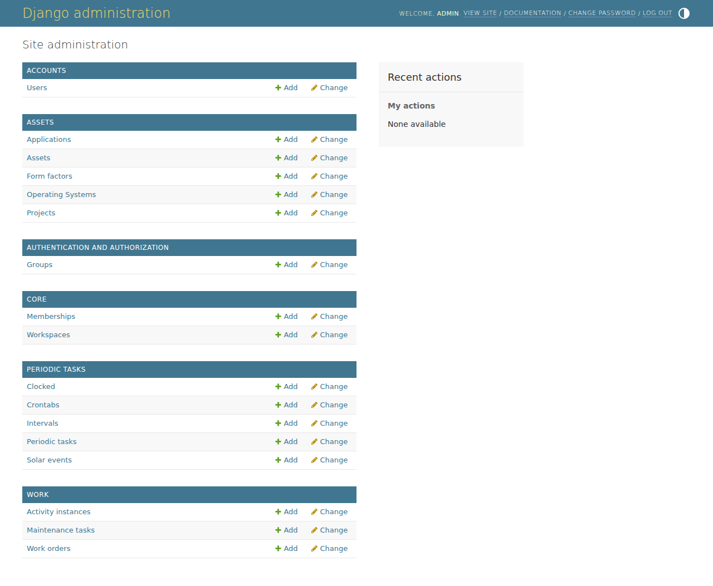
- Overview of all registered apps and models
- Clean navigation structure showing accounts, assets, core, and work apps

---

## Accounts App - User Management

### 01. CustomUser List View
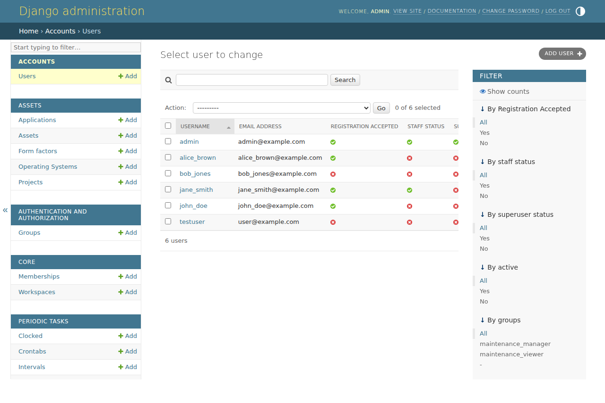
- Custom list display columns: username, email, registration_accepted, is_staff, is_superuser
- Bulk actions for registration acceptance/rejection
- Advanced filters: registration status, staff, superuser, active, groups

### 02. CustomUser Detail - Moderator Permissions
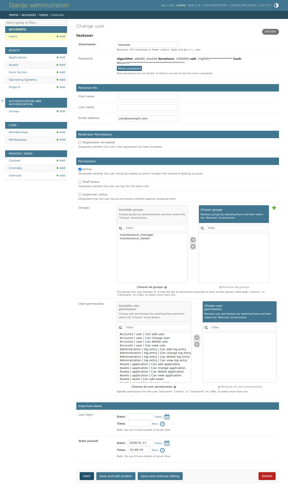
- Custom "Moderator Permissions" fieldset highlighting registration_accepted field
- Positioned strategically between "Personal info" and "Permissions"
- Shows complete user permission management interface

### 03. CustomUser Add Form
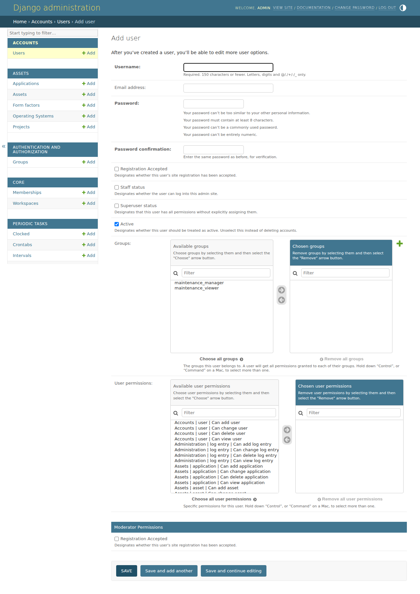
- Custom add_fieldsets with registration_accepted visible at creation
- Groups and permissions selectable during initial user setup
- Streamlined user creation workflow

---

## Core App - Workspace & Membership Management

### 04. Workspace List View
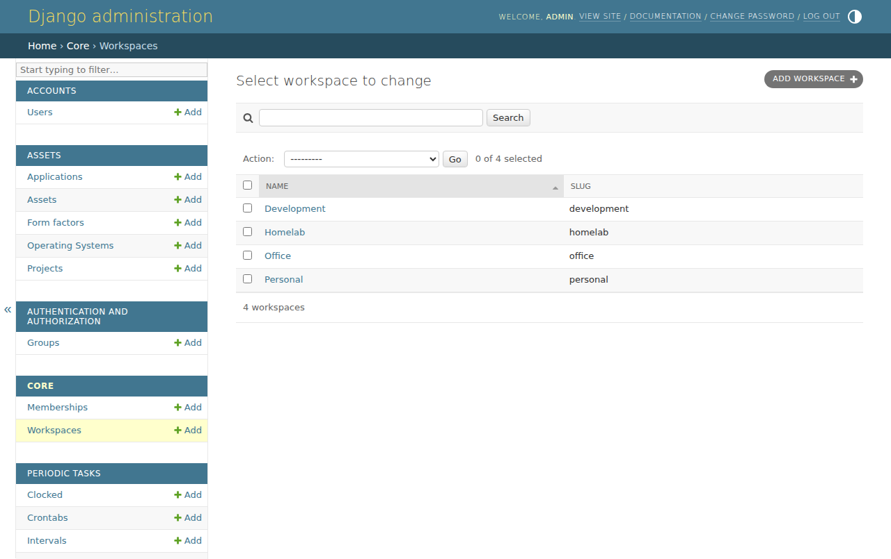
- Simple, clean list of all workspaces
- Prepopulated slug fields

### 05. Workspace Detail with Inline Memberships
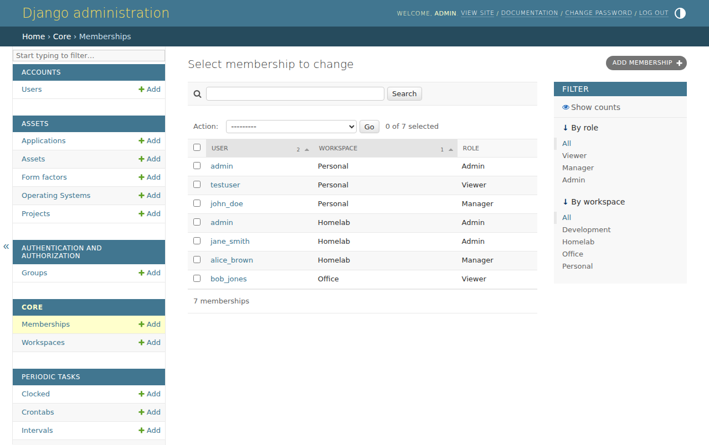
- Inline membership management within workspace detail
- Add/edit user memberships directly from workspace view
- Autocomplete for user selection

### 06. Membership List View

- Displays user-workspace-role relationships
- Filters by role and workspace
- Clean tabular view of all memberships

### 07. Membership Detail View
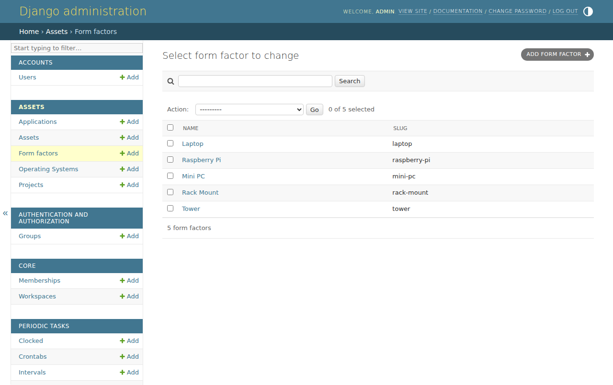
- Detailed membership editing
- Autocomplete fields for user and workspace selection
- Role dropdown with viewer/manager/admin options

---

## Assets App - Hardware & Software Management

### 08. FormFactor List View

- List of hardware form factors (Tower, Rack Mount, Mini PC, Raspberry Pi, Laptop)
- Prepopulated slug fields

### 09. FormFactor Detail View

- Simple form factor editing interface
- Name and slug management

### 10. OS (Operating System) List View
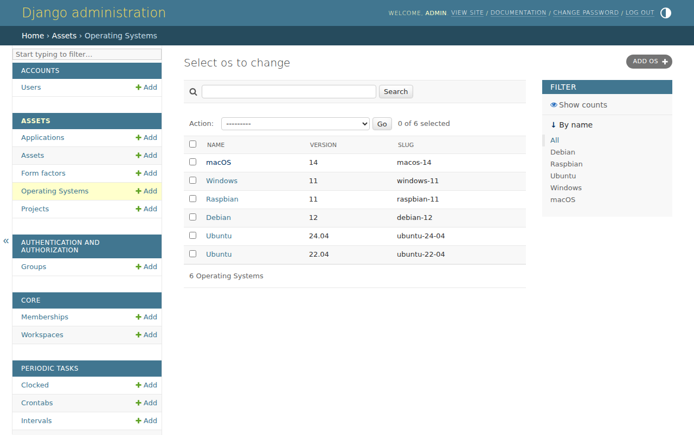
- Operating systems with versions (Ubuntu 22.04, Ubuntu 24.04, Debian 12, etc.)
- List filter by OS name

### 11. OS Detail View
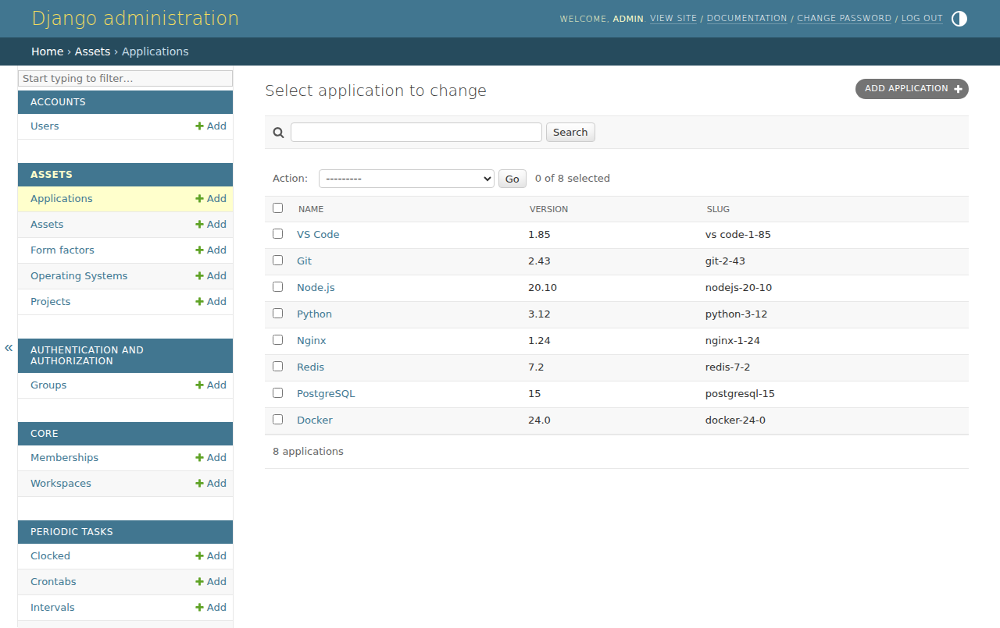
- OS name, version, and slug editing
- Clean, straightforward interface

### 12. Application List View

- Software applications with versions (Docker 24.0, PostgreSQL 15, Redis 7.2, etc.)
- Searchable by name and version

### 13. Application Detail View
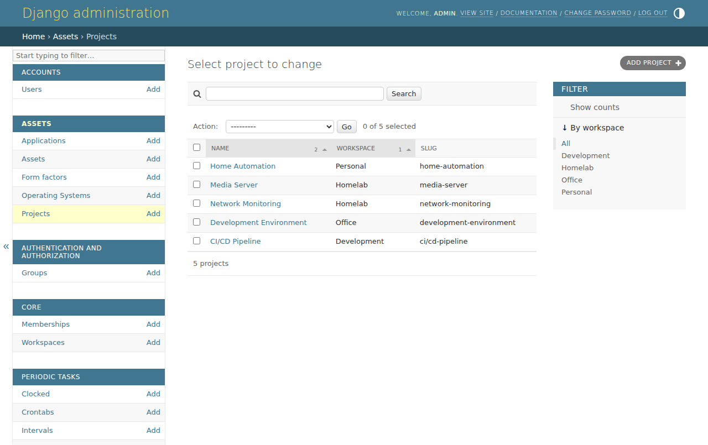
- Application name, version, and slug management
- Prepopulated slug field

### 14. Project List View

- Workspace-scoped projects
- List displays project name, workspace, and slug
- Filter by workspace

### 15. Project Detail View

- Project editing with autocomplete workspace selection
- Description field for project details
- Prepopulated slug based on name

### 16. Asset List View ⭐
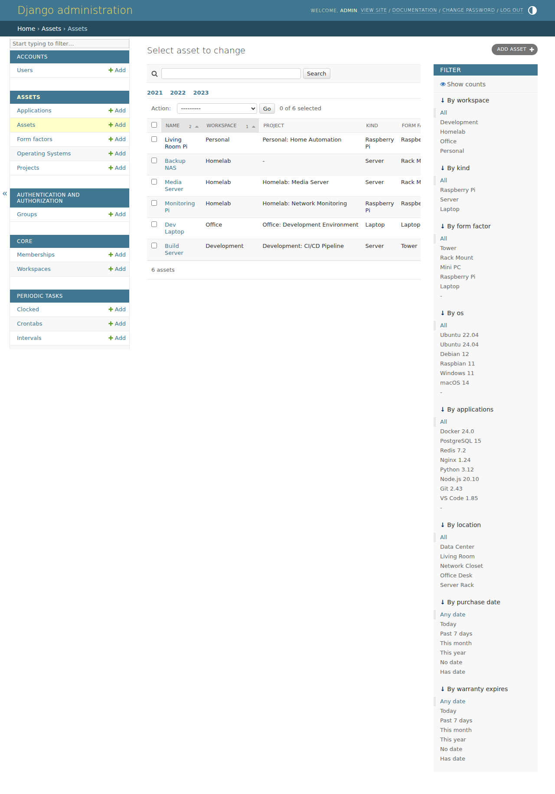
- **Custom computed columns**: warranty_status and next_due_status
- Comprehensive list display: name, workspace, project, kind, form factor, OS, location, dates
- Date hierarchy for purchase dates

### 17. Asset List with Filters Applied ⭐
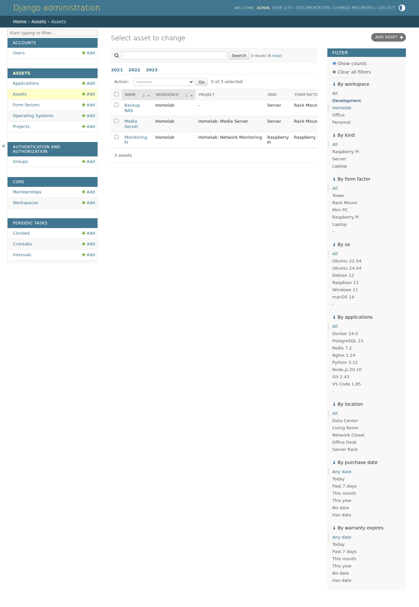
- Demonstrates extensive filter sidebar
- Filters: workspace, kind, form factor, OS, applications, location, purchase date, warranty expiry
- Shows filtered results

### 18. Asset Detail - Media Server with Inlines ⭐
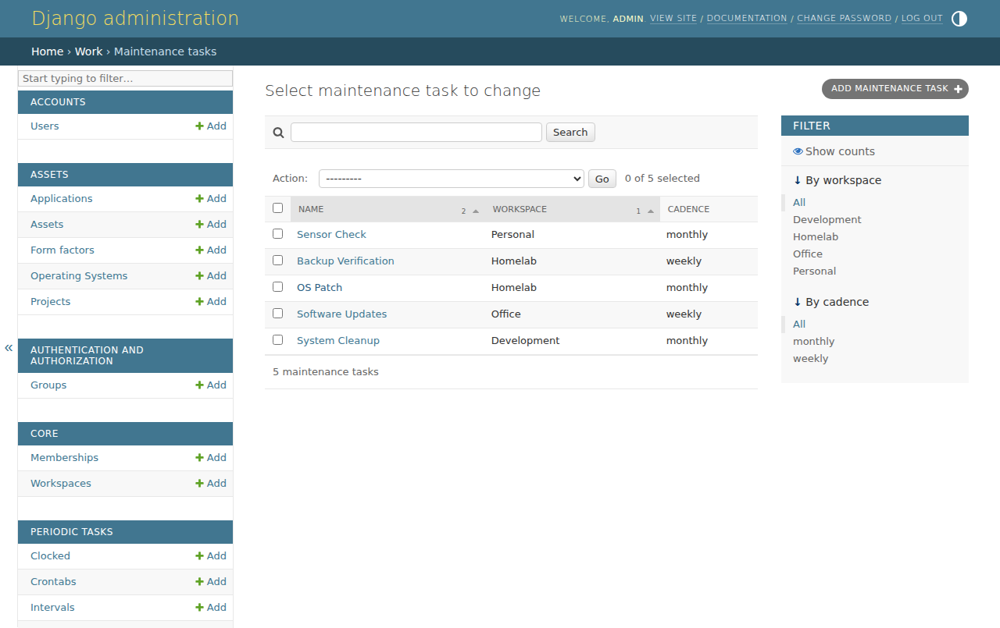
- **Inline WorkOrders**: Shows related maintenance work orders
- **Inline ActivityInstances**: Shows maintenance history
- Autocomplete fields for workspace, project, form_factor, OS, and applications
- M2M widget for multiple applications
- Notes field for additional information

---

## Work App - Maintenance & Work Order Management

### 19. MaintenanceTask List View

- Maintenance tasks by workspace
- Shows name, workspace, and cadence (weekly/monthly)
- Filter by workspace and cadence

### 20. MaintenanceTask Detail with Inline WorkOrders

- Task details with cadence and threshold configuration
- **Inline WorkOrders**: Shows all work orders generated from this task
- JSON field for threshold configuration

### 21. WorkOrder List View ⭐

- Comprehensive work order list
- **Date hierarchy navigation** by due date
- Columns: task, asset, workspace, due, status, assigned_to, requested_by
- Custom list_select_related for query optimization

### 22. WorkOrder List with Custom Due Window Filter ⭐
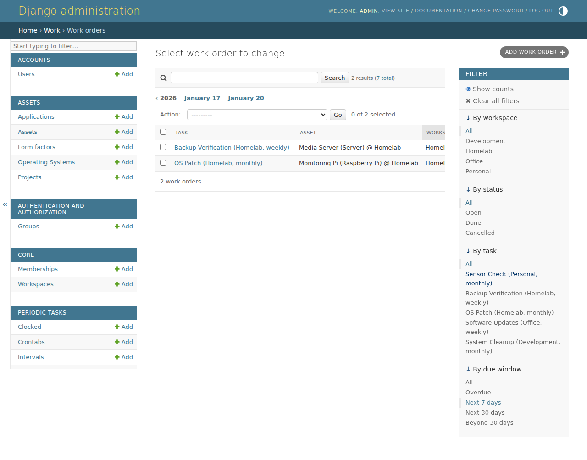
- **Custom DueWindowFilter**: Overdue, Next 7 days, Next 30 days, Beyond 30 days
- Shows filtered results (Next 7 days selected)
- Demonstrates advanced custom filter implementation

### 23. WorkOrder Detail View
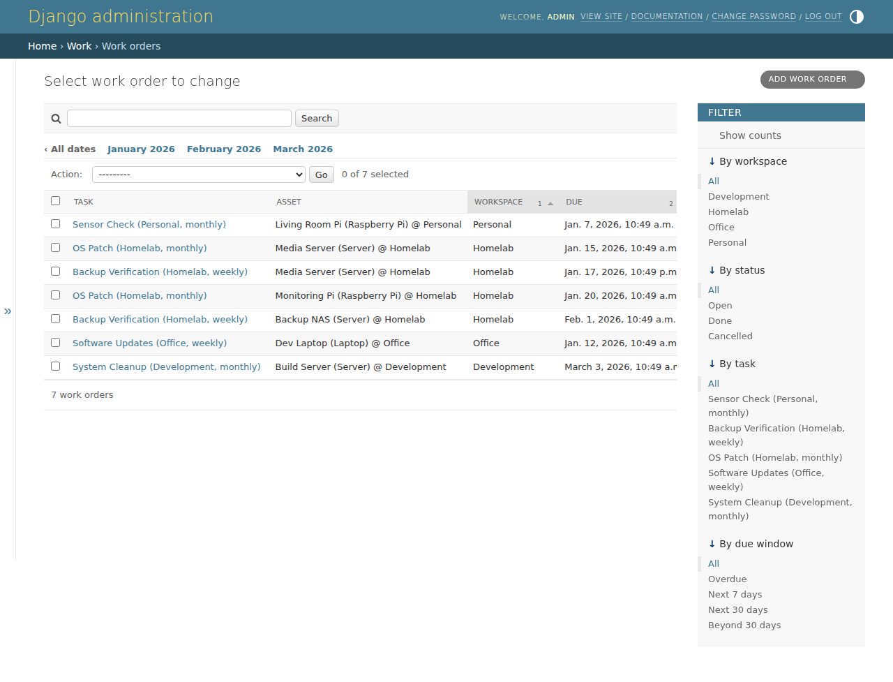
- Complete work order editing
- Autocomplete fields for asset, task, assigned_to, requested_by
- Status dropdown (open/done/cancelled)
- Due date/time picker with timezone awareness

### 24. WorkOrder Bulk Actions ⭐
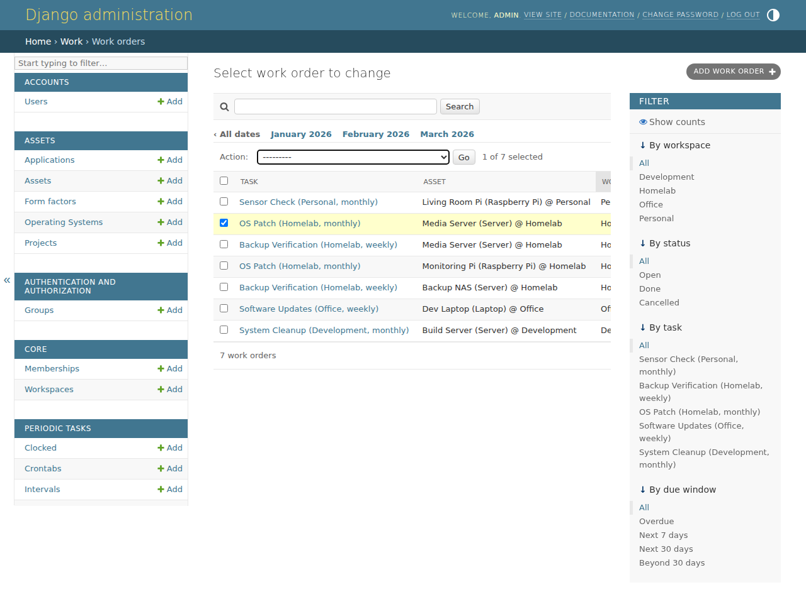
- **Custom bulk actions** demonstrated with 2 selected items
- Action dropdown showing: Mark as Open, Mark as Done, Mark as Cancelled
- Shows how bulk status changes can be performed

### 25. ActivityInstance List View
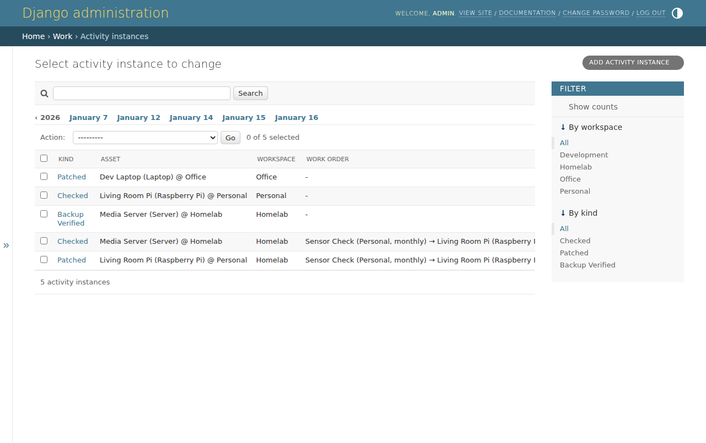
- Maintenance activity history
- **Date hierarchy** by occurred_at timestamp
- Columns: kind, asset, workspace, work_order, occurred_at, performed_by
- Ordered by most recent first

### 26. ActivityInstance Detail View
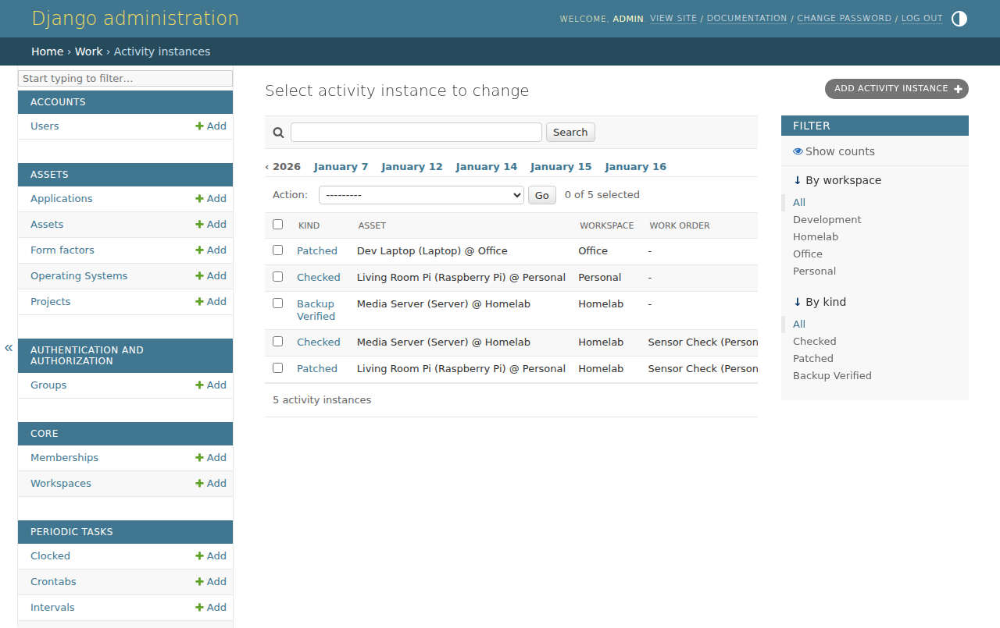
- Activity instance editing
- Kind dropdown: checked, patched, backup_verified
- Autocomplete fields for workspace, asset, work_order, performed_by
- Date/time picker for occurred_at
- Notes field for detailed activity information

---

## Key Features Highlighted

### ⭐ Most Interesting Models

1. **Asset** (Screenshots 16-18)
   - Custom computed fields (warranty_status, next_due_status)
   - Dual inline editing (WorkOrders + ActivityInstances)
   - Extensive filtering options

2. **WorkOrder** (Screenshots 21-24)
   - Custom DueWindowFilter for time-based filtering
   - Date hierarchy navigation
   - Custom bulk actions for status management
   - Multiple autocomplete relationships

3. **CustomUser** (Screenshots 01-03)
   - Custom "Moderator Permissions" fieldset
   - Custom add_fieldsets configuration
   - Bulk registration acceptance actions

### 🎯 Admin Features Demonstrated

- ✅ Custom list_display with computed fields
- ✅ Custom fieldsets and field grouping
- ✅ Custom filters including SimpleListFilter subclass
- ✅ Inline editing (TabularInline)
- ✅ Autocomplete fields for foreign keys
- ✅ Date hierarchies for temporal navigation
- ✅ Prepopulated fields (slugs)
- ✅ Bulk actions (custom admin actions)
- ✅ list_select_related for query optimization
- ✅ M2M widgets with autocomplete
- ✅ Search fields across multiple fields and relations

---

## Usage

These screenshots are intended to:
1. Document the current state of the admin interface
2. Serve as a reference for admin customization patterns
3. Help onboard new developers to the project
4. Showcase Django admin best practices

All screenshots were captured on January 17, 2026, using Django 5.2.8 with Python 3.12.
